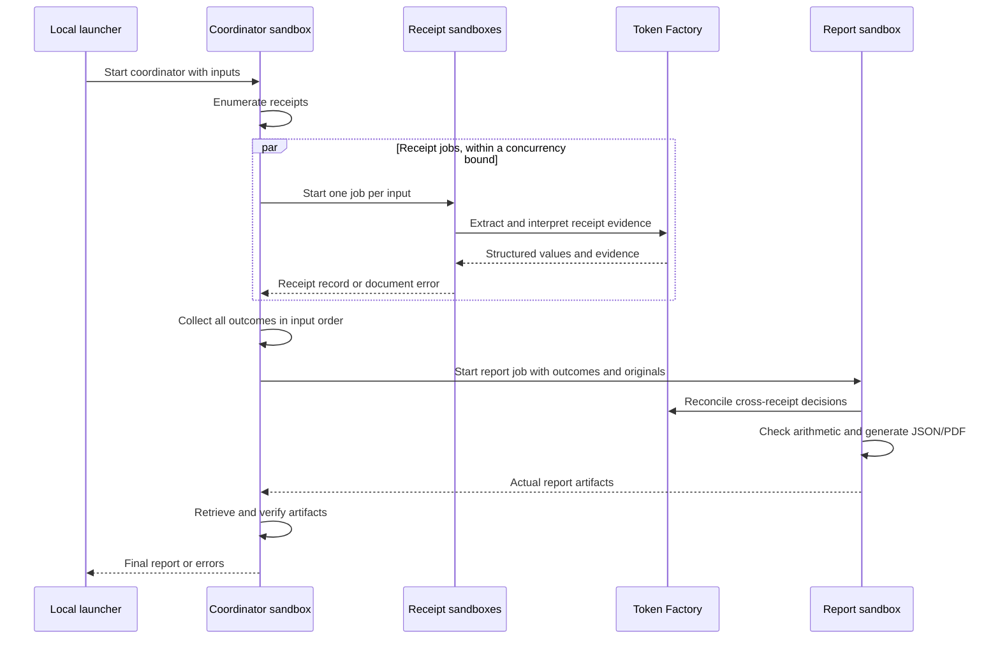

# Receipt-to-expense-report demo

This demo shows automated agents hosted in Nebius Token Factory Sandboxes, with
inference through Token Factory. The Python example generates JSON and a PDF.
See the [receipt guide](../examples/python/receipt_demo/README.md) for setup and
commands.

## Workflow

There are three agent implementations: coordinator, receipt agent, and report
agent. For N receipts, a successful run creates N receipt jobs, one coordinator
job, and one report job. The launcher starts the coordinator and receives its
result. The coordinator owns child orchestration and report retrieval.

Concurrency, inference retries, job lifetimes, and waits are bounded. A document
failure becomes an outcome while other receipts continue. Shared infrastructure
or report failures produce an explicit failed result with known outcomes where
possible. No manual correction or review stage is required.

## Shared inputs and outcomes

Use the [shared fixtures](../fixtures/receipts/README.md): English/German printed
receipts, images and multipage PDFs, multiple currencies, duplicates, and damaged
inputs. Each input file represents one receipt. Originals and source attribution
remain available to the report agent.

The [version 1 contract](receipt-contract.md) defines fields, evidence, totals,
and final outcomes. Expected fixture values and source-group annotations are
development checks, never inference evidence. This demonstrates the automated
process; it does not require exhaustive extraction accuracy or model ranking.

## Report layout

The PDF starts with a compact summary: run status, totals grouped by currency,
outcome counts, one row per input, exclusion reasons, and appendix page references.
Only included expenses contribute to totals. An all-excluded batch can still
produce a useful report without inventing zero-valued confirmed expenses.

The appendix retains each input, including duplicates and flagged receipts. Show
useful extracted fields and original pages in order. Long receipts may span
multiple pages while remaining readable. An unrenderable file gets its source
reference and an error explanation. Include attribution for public originals.

Full text and field evidence belong in JSON. Execution traces, setup details, and
sandbox job IDs stay outside the PDF. The coordinator returns retrievable artifacts
after jobs finish; the receipt guide documents file transfer and retention.
