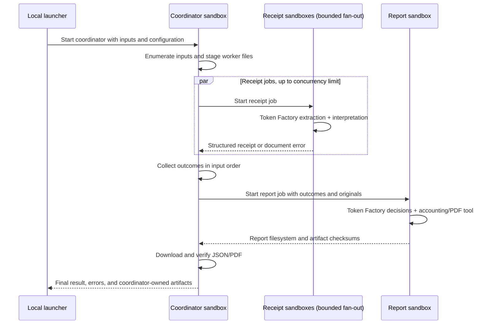

# Receipt expense-report demo

This example demonstrates hosting agents in Nebius Token Factory Sandboxes and
using Token Factory for inference. One command produces JSON and a PDF with
totals and original receipts. Flags, duplicates, and document errors are
finished automated outcomes.

The commands below run from the Python directory. From the repository root, run
`cd examples/python`. Configuration created by `python3 -m basic_demo configure` lives in
`examples/python/.env`; use `--env-file` with the receipt launcher to reuse another
existing configuration file.

See the shared [workflow](../../../docs/receipt-demo.md),
[receipt contract](../../../docs/receipt-contract.md), and
[fixture guide](../../../fixtures/receipts/README.md).

## Run it

Use Python 3.10–3.14 with the [shared SDK dependencies](../README.md#setup),
and an API key and Project ID with access to Nebius Token Factory Sandboxes.
The receipt workflow itself runs on Python 3.12.

```sh
python3 -m basic_demo configure
python3 -m receipt_demo --profile minimal --output receipt-output
python3 -m receipt_demo --profile demo --concurrency 3 --output receipt-output-demo
```

The small `minimal` profile contains a readable receipt, an unreadable total, and
a corrupt PDF. `demo` is the default 14-input batch. Other fixture profiles are
listed in the [fixture guide](../../../fixtures/receipts/README.md). Positional file paths
replace the profile selection:

```sh
python3 -m receipt_demo first.jpg second.pdf --output receipt-output-custom
```

Each output directory must be fresh. Successful runs write `report.json`,
`report.pdf`, `result.json` (the coordinator response), and `job.json` (the sandbox
operation and filesystem image IDs). `completed_with_flags` exits successfully;
a failed run exits nonzero. If a completed job's download fails, retrieve its
coordinator outputs again without launching agents or spending more inference:

```sh
python3 -m receipt_demo --retrieve COORDINATOR_FILESYSTEM_UUID --output receipt-output-retrieved
```

Use the filesystem UUID printed by the run or recorded in `job.json`. The job is
non-disposable so its files can be downloaded after the process exits. Environment
variables are not preserved in that filesystem. Inputs and generated files remain
subject to the sandbox service's retention policy; this example creates no
persistent tag and offers no deletion guarantee. Retrieve artifacts promptly.

## What runs where



For N inputs, a successful run starts N receipt jobs plus one coordinator and
one report job. There are three agent implementations. The local launcher
uploads inputs and starts only the coordinator; child submission, waiting,
collection and report retrieval happen inside that coordinator sandbox.

Use `--concurrency` (default 3, range 1–8) to bound receipt jobs, and
`--child-timeout` (default 600, range 300–1,800 seconds) to bound each child,
including dependency installation. `--timeout` bounds the whole coordinator job.
For a smaller orchestration demonstration:

```sh
python3 -m receipt_demo --profile minimal --concurrency 2 --output receipt-output-small
```

Workers receive their original input, code, and inference configuration. The
coordinator collects structured receipt records, then supplies those records and
original inputs to the report job. That job renders the originals for the appendix layout. Worker-local image paths are not reused across filesystems.
Completed child filesystems remain available for immediate retrieval; no persistent
tags or separate storage service are created.

`job.json` records the parent operation immediately after submission; its `image`
is null until polling succeeds, then identifies the final filesystem. The coordinator's
`result.json` also contains `jobs`, with each child's role, input ID, operation ID,
filesystem, and timestamps. Receipt worker start/finish timestamps let you verify
overlapping execution. Console logs show child submissions, completion, receipt
collection, report retrieval and the final coordinator result.

Only the coordinator receives the `CONTREE_*` sandbox API configuration. Receipt
and report jobs receive the inference environment, with environment preservation disabled in
every job. Dependency installation receives neither credential. Model prompts
contain receipt evidence rather than orchestration credentials.

A failed or timed-out receipt process becomes an error outcome and other receipts
continue. Shared API/configuration failures, report failures and artifact checksum
failures produce a failed coordinator response with known outcomes. The coordinator
cancels active children on exceptions, its internal deadline, or a handled
SIGTERM/SIGINT, using the [operation cancellation API](https://docs.tokenfactory.nebius.com/api-reference/sandboxes/operations/cancel-an-operation).
Its internal deadline reserves 60 seconds before the server timeout for cleanup
and output. Cancellation requests are best effort: abrupt VM termination cannot
run Python cleanup, so every child also has its own server timeout. A submission
whose response is lost is never blindly retried; without a returned operation ID,
the child's server timeout is the remaining bound.

## Python module responsibilities

Both launchers use the same sandbox client. It operates on images, files,
commands, and operations without knowing about Python, receipts, or reports.

| Module | Responsibility |
| --- | --- |
| `nebius_sandbox.py` | Image listing/import, file upload/download, command submission, operation polling/cancellation, and execution-result decoding |
| `http_transport.py` | Inference model discovery transport and the shared transport-error type |
| `configuration.py` | Read local configuration and construct explicit sandbox settings |
| `receipt_demo/configuration.py` | Receipt inference settings and the child environment |
| `receipt_demo/sandbox.py` | Package the Python files and choose the receipt jobs' bootstrap, paths, environment, and resource limits |
| `receipt_demo/orchestration.py` | Bound receipt fan-out, collect results, cancel children, and dispatch the report job |
| `receipt_demo/execution.py` | Load each worker's role, dispatch its agent, and own worker credential cleanup |
| `receipt_demo/inference.py` | Construct Token Factory models from explicit settings |
| `receipt_demo/agents.py` | Coordinator, receipt, and report agent behavior |
| `receipt_demo/artifacts.py` | Report artifact references and verified downloads |
| `basic_demo/__main__.py`, `receipt_demo/__main__.py` | Local commands, configuration loading, and user-facing output |

`SandboxClient.submit()` returns the operation ID immediately. `wait()` checks
whether the operation succeeded; `Operation.execution_result()` separately checks
the sandbox process and decodes its output. The receipt workflow then checks the
worker's `result.json`. These distinguish transport failures, failed operations,
failed processes, and failed agent workflows. Async child polling stays in the
coordinator so its concurrency and cancellation behavior remain explicit.

Code upload is shared between the local launcher and coordinator. Workers receive
the client, configuration, and receipt package; they do not need either local
launcher. The uploaded shared requirements install the SDK/client pins inside
each worker before importing the provider. See [SDK compatibility](../../../docs/sandbox-sdk.md).

## Inference configuration

| Variable | Default / purpose |
| --- | --- |
| `NEBIUS_API_KEY` | Required Token Factory inference key |
| `CONTREE_TOKEN` | Sandbox credential; falls back to inference key |
| `CONTREE_PROJECT` | Sandbox Project header |
| `CONTREE_BASE_URL` | Sandbox API; existing demo default |
| `CONTREE_IMAGE` | Optional existing image with `/usr/local/bin/python3` and pip |
| `NEBIUS_AGENT_MODEL` | `Qwen/Qwen3-30B-A3B-Instruct-2507` for receipt interpretation and coordinator/report tool calls |
| `NEBIUS_VISION_MODEL` | `openbmb/MiniCPM-V-4_5` for image extraction |
| `NEBIUS_BASE_URL` | `https://api.tokenfactory.nebius.com/v1` |
| `NEBIUS_VISION_BASE_URL` | Falls back to `NEBIUS_BASE_URL`; can select a regional endpoint |

The tiny prime/tool example's `NEBIUS_MODEL` remains separate. Both receipt models
use explicit `OpenAIChatModel` and `OpenAIProvider` instances pointing to Token
Factory Chat Completions. The extraction model uses JSON-object mode with a
schema prompt and local Pydantic validation; it does not need tool calling.
Coordinator/report models need tool calling. Changing models requires compatible
capabilities and access on the selected endpoint.

Each receipt agent makes two bounded inference steps: the vision model transcribes
the pages, then the agent model interprets that text. The second call identifies
the payable total and distinguishes items/subtotals, discounts, added or included
tax, tender, change, carry-forward, and conversion amounts. This is internal to the
same receipt-agent implementation, not a fourth agent or a human review stage.
The original extracted page text remains in the result JSON. Interpretation errors
preserve that text when available. The supplied images determine page count and
order; an extraction that duplicates or omits pages gets the bounded validation
retry, and source page numbers are assigned by code.

The inference key goes only into the sandbox execution environment, is removed
from the agent process environment by the worker entrypoint before constructing models, and is excluded
from the dependency-install subprocess. Sandbox API configuration is held only by
the coordinator. Logs record agent stages,
selected models, and job IDs, excluding raw
model errors and credentials.

## Data and automatic outcomes

Version `1` JSON retains every source identity, merchant/date/currency, purchase or
refund direction, printed/normalized total, original page references, page text
and reading-order blocks, optional items/tax/discount, field evidence, and issues.
The JSON includes parsed receipts as well as reconciled entries and currency totals.
Money is represented as decimal strings; unknown fields are null. Original page
paths describe files within the job; the downloaded PDF embeds the rendered
originals so the report remains usable after remote storage expires.

- `included`: a resolved signed expense contributes once to its currency total.
- `flagged`: critical monetary uncertainty, an obvious contradiction, or suspected
  duplication excludes the expense. A missing secondary field alone need not.
- `duplicate`: confirmed duplicate, with `duplicate_of`; retain its source appendix.
- `error`: the source cannot be rendered or extraction attempts are exhausted.

When the report tool runs, Python checks a complete classified equation using one
basis: line items or a single subtotal, plus applicable discounts, added tax and
fees. Final totals, included tax, tender, change, carry-forward, and conversion
amounts are never addends. An incomplete equation does not create a false mismatch;
unknown critical expense fields still cause exclusion. Python applies decimal
arithmetic and signed refunds, with no FX conversion. Byte/pixel hashes detect
exact and re-encoded duplicates from actual inputs; semantic duplicate candidates
come from the report agent. Its instructions require positive shared-transaction
evidence for duplicate candidates and a concrete monetary conflict for additional
flags; similar layouts or missing item details alone are insufficient. Fixture
recipes, expected values, and source-group labels never become agent evidence.
Attribution is passed only to report rendering.

The PDF starts with totals, counts, a row per input, and appendix page references.
Each appendix contains extracted summaries and original pages in order; long
receipts may span multiple strips/pages. Unrenderable files get an explanatory
placeholder. Full transcription/evidence stays in JSON. No included receipts means
no confirmed totals, rather than an invented zero expense amount.

## Bounds and failures

The launcher accepts up to 30 inputs / 50 MiB; each PDF has at most eight pages and
each rendered page at most 25 million pixels. The default job timeout is 1,800
seconds, configurable from 300 to 3,600. Dependency setup has a 240-second limit.
Inference HTTP attempts have a 90-second timeout and one transport retry. The
coordinator is limited to one model request. Each receipt has up to two extraction
requests and two interpretation requests (one validation retry per step). The
report agent has at most two requests. Output-token caps are 6,500 for extraction,
4,500 for interpretation, and 6,500 for reporting. Sandbox job submissions are
never automatically retried after ambiguous responses.

Document failures are contained and the batch continues. Shared authentication or
model-access errors, report failures, and artifact-copy failures produce a failed
coordinator response with known outcomes where possible. If the process itself
fails before it can respond, the launcher reports the job failure. Local wait
timeouts/interrupts attempt operation cancellation; the server timeout is an
independent bound. Downloaded artifacts are checked against the coordinator's
byte counts and SHA-256 before a successful local result is published.

## Development

Use the [shared Python development setup](../README.md#development).

Automated checks cover the concurrency bound,
out-of-order completion, original transfer, child timeout containment, shared
failure cancellation, cancellation during submission, local wait deadlines,
parent cancellation, report failure, checksum failure, no ambiguous-submission
retry, coordinator artifact ownership, and the default orchestration command.
They also cover generic sandbox request mapping, safe transport errors, explicit
configuration, actual receipt/report worker file handoffs, and imports from the
uploaded package without local launchers.

Implementation references: [sandbox file upload](https://docs.tokenfactory.nebius.com/api-reference/sandboxes/files/upload-a-file-to-the-server-the-body-must-be-a-file-content),
[file download](https://docs.tokenfactory.nebius.com/api-reference/sandboxes/inspect/download-a-file-from-image),
[instance lifecycle](https://docs.tokenfactory.nebius.com/api-reference/sandboxes/instances/spawn-a-new-container-instance),
and [Pydantic AI provider configuration](https://pydantic.dev/docs/ai/models/openai/).
