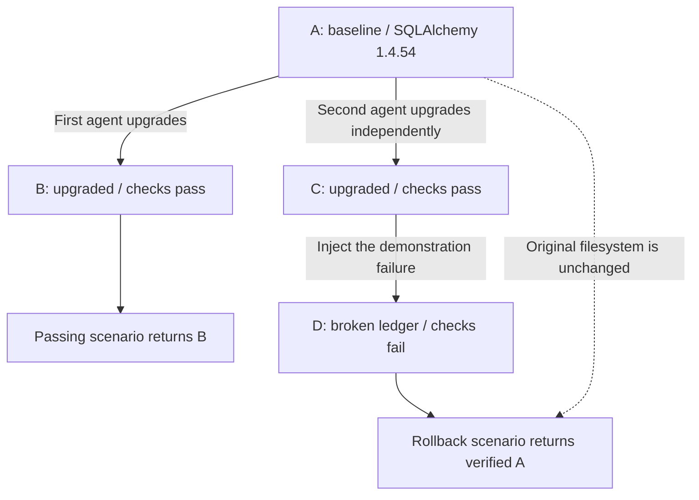

# Dependency upgrade with checkpoint rollback

A Token Factory-backed OpenCode agent upgrades a small SQLite ledger from
SQLAlchemy `1.4.54` to `2.0.36` inside Nebius Token Factory Sandboxes. The upgrade
must replace the removed `Engine.execute` API and implicit autocommit while
preserving existing ledger entries and behavior.

## Follow the checkpoints

A checkpoint saves the sandbox's filesystem, including installed packages, source
code, and the SQLite database file. Starting a new sandbox from it gives a fresh
process with those files already present. The starting checkpoint stays unchanged
while the new sandbox does its work.

The letters below are explanatory labels for checkpoint IDs. The default demo
runs these steps:

1. **Prepare A, the upgrade baseline.** Install SQLAlchemy `1.4.54`, create the
   working ledger with three known entries, and retain the filesystem. Verify it
   before either agent task starts.
2. **Start the passing attempt from A.** An agent installs `2.0.36` and edits
   the ledger code in a fresh child. Its finished filesystem is checkpoint **B**.
   Independent checks pass, so this scenario returns B as its selected result.
3. **Start the rollback attempt from A too.** A second agent gets the original
   `1.4.54` environment, independently produces checkpoint **C**, and passes the
   same upgrade checks. It does not inherit B's edits.
4. **Create a deliberately broken child D from C.** A separate job disables the
   ledger entrypoint, leaving C intact. Checks against D fail. This makes the
   rejection path reproducible even when the agent did a good job.
5. **Verify A and select it again.** Start a check from A to confirm that its
   original files, dependency version, and ledger behavior remain intact. Return
   A as the rollback scenario's selected result, keeping the failed branch's
   checkpoint and logs for inspection.



Rollback is a choice of **which saved environment to return**. No downgrade
command runs in D, and no edits are applied backwards. To continue with the
working ledger, a caller starts another job from A's image ID. That job already
has SQLAlchemy `1.4.54`, the original code, and the three original database entries.
The demo returns this usable checkpoint; it does not deploy a service or launch
that next job automatically.

Checks also run in fresh children, omitted from the diagram for readability.
They are disposable: temporary databases created by tests do not become part of
the selected checkpoint. The original SQLite database is included in the saved
filesystem; changes made through an API to a database outside the sandbox would
not be undone by selecting A.

In `run/upgrade.json`, these labels correspond to:

| Label | Field |
| --- | --- |
| A | `baseline.image` |
| B | `scenarios[0].agent.image` |
| C | `scenarios[1].agent.image` |
| D | `scenarios[1].injection.image` |
| Returned checkpoint for each scenario | `scenarios[i].selected_result.checkpoint` |

For a successful default demonstration, the first selected checkpoint equals B,
and the second equals A; both have `selected_result.verified: true`. If A cannot
be verified after rejection, its reference is retained with `verified: false`
and an explicit failure outcome. When running one scenario with `--scenario`,
look it up by its `name` rather than assuming the default array positions.

## Run

Use the shared [Python setup](../README.md#setup) and configure `NEBIUS_API_KEY`
for inference. Sandbox access uses `CONTREE_TOKEN`, falling back to that same key;
`CONTREE_PROJECT` and `CONTREE_BASE_URL` are optional. `--env-file PATH` selects a
configuration file; shell environment values take precedence. Run from
`examples/python`:

```sh
.venv/bin/python -m upgrade_demo --output upgrade-output
```

This prepares a coding runtime and one verified baseline, then runs two
independent agent tasks from that exact baseline:

1. **Passing:** install the target version, migrate the code, and return the
   candidate only after authoritative checks pass.
2. **Rollback:** first verify another real agent's upgrade, then deliberately
   disable its ledger entrypoint. Reject the broken descendant and select the
   original baseline after independently verifying its files and tests.

The default command intentionally exits **1** when the rollback scenario rejects
its upgrade. Read `run/upgrade.json`: `demonstration_complete: true` means both
intended paths were demonstrated. A failure before regression injection is a real
upgrade failure, not evidence of the controlled rollback demonstration.

To run either scenario separately and reuse an existing coding runtime:

```sh
.venv/bin/python -m upgrade_demo --runtime upgrade-output/runtime/runtime.json \
  --scenario passing --output upgrade-output-pass
.venv/bin/python -m upgrade_demo --runtime upgrade-output/runtime/runtime.json \
  --scenario rollback --output upgrade-output-rollback
```

Each invocation prepares a new baseline; use the default `both` scenario to
demonstrate both branches from the same baseline. Always use a fresh output
directory. `--runtime` expects a prepared coding runtime, not a prior task or
upgrade candidate. `--model` overrides `NEBIUS_CODING_MODEL` and the shared coding
demo's default. `--timeout` is 60–600 seconds per agent task, default 600, subject
to the account's limit. The agent may edit and test within that single task;
the orchestrator never submits a replacement automatically.

Runtime/dependency preparation and agent execution need networking. Trusted
validation and regression injection run without networking. Validation has a
60-second execution cap and a 180-second observer deadline. Checkpoints remain
subject to service retention limits; local reports are not a permanent remote
checkpoint store.

## What the checks prove

The baseline contains three synthetic expenses: food `1200`, food `-200`, travel
`500`, in integer cents. Its report must have food `1000`, travel `500`, total
`1500`, and count `3`. Trusted checks verify these inherited records and run
new-ledger transactions in separate processes to catch missing commits.

The host supplies the authoritative checker afresh to a disposable child of the
actual candidate checkpoint. It checks the installed SQLAlchemy version, the
project pin, CLI totals, persisted database rows, and inherited data. Agent-edited
checks cannot weaken that gate. Test writes stay in disposable children, so the
selected candidate has no validation-created transactions.

For controlled failure, `injection` saves the passing source as
`ledger.before-injection.py`, replaces `ledger.py` with an explicit exception,
and adds `injected-regression.txt`. The JSON records both successful validation
before injection and failing validation afterward. Baseline verification runs
against the original checkpoint, comparing its complete workspace file manifest
to the hashes captured before either agent ran, then rerunning the ledger checks
with SQLAlchemy `1.4.54`. This also proves the injected files did not appear there.

The known-good implementation under `reference/` is used only by automated tests.
Live agent failures always trigger baseline selection; reference code is never
uploaded to repair or replace a live result.

## Results and diagnostics

`run/upgrade.json` is the machine-readable result; stdout also contains progress.
It records runtime/baseline/agent/injection relationships, operation identities,
validation reports, scenario completion, and each scenario's `selected_result`.

| Scenario outcome | Selected result | Exit status |
| --- | --- | --- |
| `upgrade_accepted` | Validated candidate, `verified: true` | 0 when all requested upgrades are accepted |
| `upgrade_rejected_baseline_verified` | Independently verified original baseline | 1 |
| `upgrade_rejected_baseline_unverified` | Original baseline reference, `verified: false`; verification incomplete | 1 |
| `upgrade_rejected_baseline_failed` | Original baseline reference, `verified: false`; baseline tests failed | 1 |

The selected checkpoint includes the installed environment. Its local
`workspace.tar.gz` contains project files and ledger data, not installed
dependencies. The baseline archive and available agent/regression archives are
retained, together with prompts, agent logs, trusted check stdout/stderr, and
per-operation `run.json` records. Missing or inconclusive checks cannot accept an
upgrade or claim verified recovery. An unconfirmed/cancelled agent stops further
scenarios and retains its operation identity; reconnecting must not submit new
work. The existing coding monitor can observe that task with its `agent` output
directory, but it does not resume this orchestration.

`upgrade-output*/` is ignored by Git. Keep output elsewhere out of Git too:
generated artifacts and live infrastructure IDs belong in local evidence, not
source control. There is no interactive approval or repair stage in the demo.

## Development

Install `../requirements-dev.txt`, which includes the pinned SQLAlchemy 2 fixture
test dependency. From `examples/python`:

```sh
.venv/bin/python -m unittest discover -s upgrade_demo/tests -t . -v
```

These tests need no credentials, model calls, or sandbox jobs. They exercise the
real ledger/checker commands and orchestration outcomes at the sandbox service
boundary.
